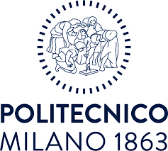

<h1 align="center">Recommender System 2024-2025 Challenge - Polimi</h1>

  

[Link to competition](https://www.kaggle.com/competitions/recommender-system-2024-challenge-polimi/overview)

## Results
Evaluated (final results):
* MAP@10 - private: 0.10128
* MAP@10 - public: **0.10286**
* Ranked **10nd**

Best metrics:
* MAP@10 - private: **0.10170**
* MAP@10 - public: 0.10271
* Ranked **13nd**

## Application domain & Goal
The application domain is book recommendation. The provided datasets contains interactions of users with books.
The main goal of the competition is to discover which new books a user will interact with. We had to recommend a list of 10 potentially relevant new items for each user.

## Evaluation

For evaluation, the MAP@10 metric was used.

The average precision at 10, for a user is defined as:

$$
AP@10 = \frac{\sum_{k=1}^{10} P(k) \cdot \text{rel}(k)}{\min(m, 10)}
$$

Where:
- $P(k)$ is the precision at cut-off $k$,
- $\text{rel}(k)$ is 1 if the item at position $k$ is relevant, and 0 otherwise,
- $m$ is the number of relevant items in the test set.

The mean average precision for $N$ users at position 10 is the average of the average precision of each user:

$$
MAP@10 = \frac{\sum_{u=1}^{N} AP@10_u}{N}
$$

## Dataset
The datasets includes around 1.9 M interactions, 35k users, 38k items (books) as well as 94k item features.
The training-test split is done via random holdout, 80% training, 20% test.

## Best Public solution
Our best public solution was ensemble of three algorithms:
* SLIM ElasticNet
* RP3Beta

## Advanced Theory Exam
In addition we provide file, with summary of all...

## Team
* Iusupov Safuan [Telegram](https://t.me/IusupovSafuan) | [GitHub](https://github.com/SAFUANlip) | [Email](safuan.iusupov@mail.polimi.it)
* [Timothé Watteau](https://t.me/TheirTelegramUsername) | [GitHub](https://github.com/TheirGitHubUsername) | [Email](mailto:their.email@example.com)

